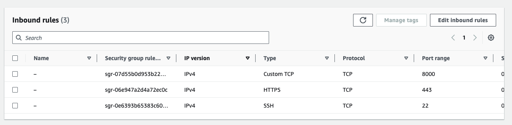
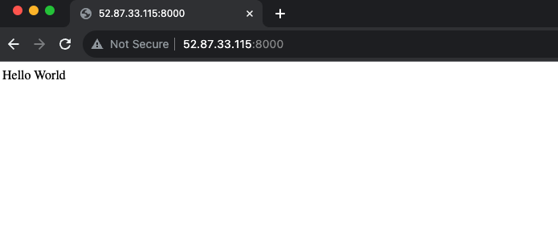
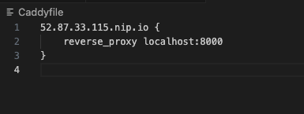
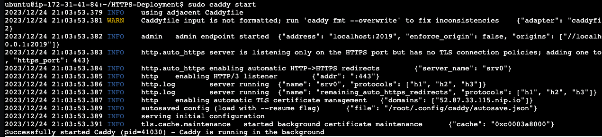
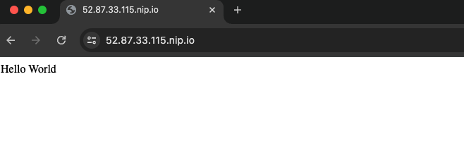

# HTTPS-Deployment-Without-Custom-Domain-Name
This shows how to secure your websites with HTTPS without buying domain name and certificates. 
<br/>

## HTTPS without purchasing domain name
The recommended way of securing your website is by using SSL or TLS certificates installed on your website. Most certificate authorities require you to have a custom domain name. However, it is possible to use just your instance IPaddress but it is not encouraged for so many reasons and its also quite complicated to achieve.

Here i will show a simple way of achieving this without a custom domain name by using [nip.io](https://nip.io/) as a DNS and [caddy](https://caddyserver.com/) as a reverse proxy.

### Steps 

1. Create an EC2 instance with with inbound rules to 443 (https port) and 8000 (website port)

    

2. Create a simple index.html with "Hello World" as its content.

3. Serve the html page on port with this:

    ```bash 
        python3 -m http.server 8000
    ```

    

    you will notice it is not secure. Let's fix this and enable SSL on this server.

4. Now install candy on the server. Instructions can be found [here](https://caddyserver.com/docs/install#debian-ubuntu-raspbian). Caddy 2 is a powerful open source web server with automatic HTTPS. Caddy simplifies your infrastructure and takes care of TLS certificate renewals.

5. Next we'll create a file named Caddyfile with the following contents.

    
   
   Here, we are using nip.io as a DNS. nip.io allows you to map any IP Address to a hostname without the need to edit a hosts file or create rules in DNS management. Remeber to replace with your ip address and the port number.

6. Save the file and run the command `sudo caddy start`. This runs it in the background.

    

    This will start Caddy certificate management service and download a certificate for the indentifier

7. Now you can see the site is secure

    


